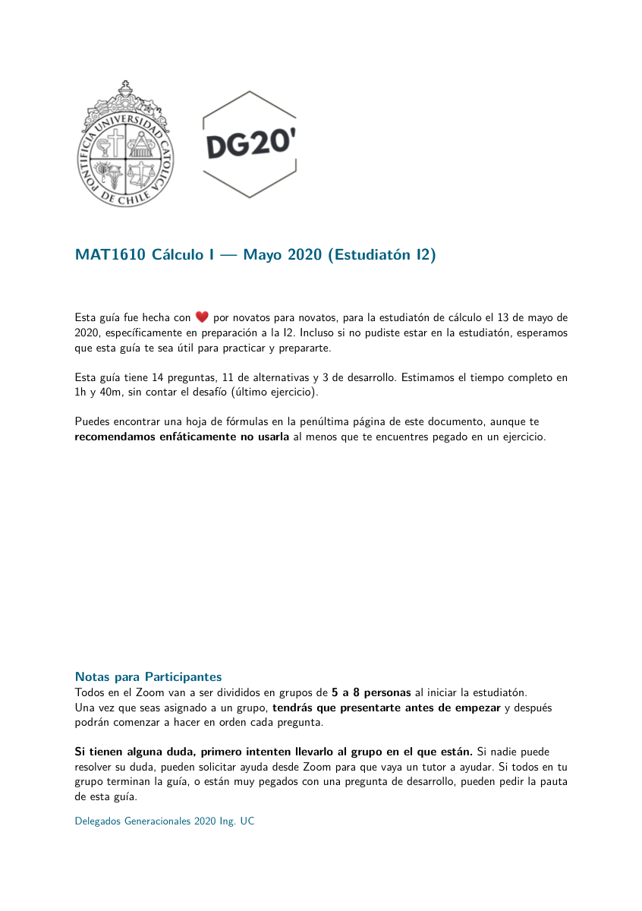
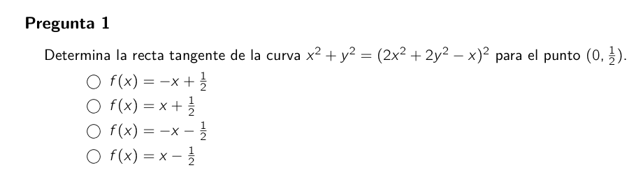

# Plantilla Dinámica UC

[](https://github.com/agucova/plantilla-uc/actions?query=workflow%3A%22Lint+y+Compilaci%C3%B3n%22)
> “Enunciados con emojis.”
> — Œ CAi

La idea de este proyecto es proveer **una plantilla atractiva, moderna y dinámica para distintas clases de evaluaciones y guías de trabajo dentro de la UC.**

Esta plantilla es una derivación directa de la plantilla existente y públicamente liberada de la Escuela de Ingeniería de la Universidad de Edinburgh. Puedes ver mas información de la licencia pertinente en [LICENSE.md](LICENSE.md).

La plantilla otorga diversas opciones que permiten formar un documento listo en minutos, con alta flexibilidad y código mantenible.

Este proyecto no tiene ninguna afiliación de carácter oficial con la Universidad Católica.
<p align="center">


</p>

## Uso

Para usar la plantilla, debes modificar los dos archivos base, `documento.tex` y `formulas.tex` (opcional), al igual que los archivos de preguntas, que se encuentran ubicados en `preguntas/`.

```js
├── LICENSE.md // licencia
├── README.md // este documento
├── README_original.txt // guía original (en inglés)
├── base.tex // documento auxiliar principal
├── documento.tex // documento principal
├── portada.tex // portada del documento
├── formulas.tex // hoja de fórmulas (cheat sheet, opcional)
├── emoji.ttf // tipografía para emojis (Noto Color Emoji)
├── coloremoji.sty // archivo auxiliar para emojis
├── imagenes/
│   ├── delegados2020.png
│   └── puc_comunitario.png
├── preguntas/ // preguntas de ejemplo
│   ├── alternativas.tex
│   ├── catorce.tex
│   ├── doce.tex
│   └── trece.tex
├── out/
│   └── documento.pdf // PDF de ejemplo
├── chktexrc // config. de chktex
└── .latexmkrc // config. de latexmk
```
En los archivos base, podrás configurar características del documento según tus necesidades, como:

- Soporte de emojis ✨
- Unidad Académica
- Código del Curso y Título
- Fecha del Documento
- Presencia de respuestas (genera rúbricas automáticamente)
- Número de preguntas que hay que responder
- Si se puede utilizar calculadora
- Si se incluye una hoja de fórmulas
- Si la prueba es con libro abierto
- Si requiere puntaje por pregunta
- ...

Para compilar el documento, es importante usar LuaLaTeX (no PDFLaTeX o XeTeX). El soporte de emojis requiere usar el `lualatex-dev` disponible en TeXLive 2020 (es necesario LuaHBTeX).

Todos los ajustes del entorno se encuentran configurados en `.latexmkrc`, por lo que compilar solo requiere:

```bash
$ latexmk
```

Este repositorio está configurado para compilar y correr `chktex` en cada actualización del documento.

## Cosas por Hacer

- Aprobar versión reducida del código de honor
- Configurar texto para calculadora, fórmulas y libro abierto
- Hacer que el logo sea configurable
- Mejorar preguntas de ejemplo
- Guía de uso detallada
