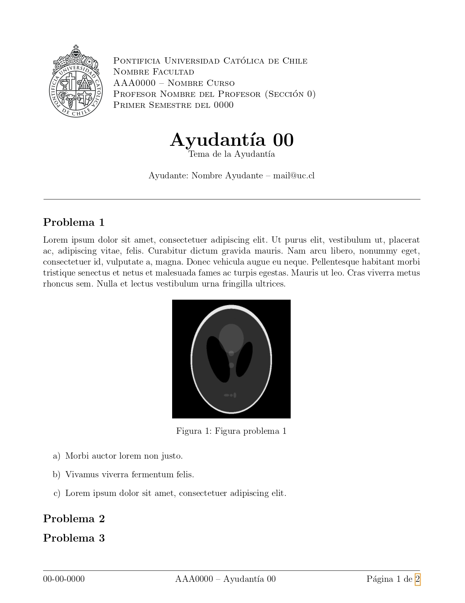

<h1 align="center">
   
  <a href="#">Plantillas LaTeX</a>
</h1>

<h4 align="center">Repositorio donde se recopilan los templates creados por la comunidad OSUC</h4>

  <a href="#plantillas-disponibles">Plantillas</a> •
  <a href="#cómo-usar">Uso</a> •
  <a href="#cómo-contribuir">Contribuir</a> •
  <a href="#créditos">Créditos</a> •
  <a href="#contacto">Contacto</a>

  

## Descripción

Este repositorio recopila diversas plantillas en LaTeX para informes, tesis, ayudantías y otros documentos académicos de la UC. El objetivo es facilitar la creación de documentos profesionales y estandarizados.

## Estado del Proyecto

El repositorio está en proceso de mantención y reactivación. Todas las contribuciones deben ir a la rama `develop`.

## Plantillas Disponibles

| Nombre | Imagen | Descripción | Descargar |
| :-----: | :----: | :---------- | :-------- |
| Informes UC |  | Minimalista y documentada para informes de laboratorio, siguiendo norma APA. | [Descargar](https://download-directory.github.io/?url=https%3A%2F%2Fgithub.com%2Fopen-source-uc%2Flatex-templates%2Ftree%2Fmaster%2Ftemplates%2Finformes-uc) |
| Práctica 1 |  | Para la práctica 1. | [Descargar](https://download-directory.github.io/?url=https%3A%2F%2Fgithub.com%2Fopen-source-uc%2Flatex-templates%2Ftree%2Fmaster%2Ftemplates%2Fplantilla-practica-1) |
| Práctica 2 |  | Para la práctica 2. | [Descargar](https://download-directory.github.io/?url=https%3A%2F%2Fgithub.com%2Fopen-source-uc%2Flatex-templates%2Ftree%2Fmaster%2Ftemplates%2Fplantilla-practica-2) |
| UC |  | Moderna y dinámica para evaluaciones y guías UC. | [Descargar](https://download-directory.github.io/?url=https%3A%2F%2Fgithub.com%2Fopen-source-uc%2Flatex-templates%2Ftree%2Fmaster%2Ftemplates%2Fplantilla-uc) |
| Ayudantías |  | Versátil y fácil de usar para ayudantías UC. | [Descargar](https://download-directory.github.io/?url=https%3A%2F%2Fgithub.com%2Fopen-source-uc%2Flatex-templates%2Ftree%2Fmaster%2Ftemplates%2Fayudantias_ivl) |
| Programa Cursos |  | Para programas de cursos UC. | [Descargar](https://download-directory.github.io/?url=https%3A%2F%2Fgithub.com%2Fopen-source-uc%2Flatex-templates%2Ftree%2Fmaster%2Ftemplates%2Fplantillas-programas-cursos) |
| Thesis |  | Plantillas para tesis UC. | [Descargar](https://download-directory.github.io/?url=https%3A%2F%2Fgithub.com%2Fopen-source-uc%2Flatex-template-msc%2Ftree%2Fa492fe1f74109aa3b67e3195988da15eaf3445e5) |
| Informes 2 |  | Basada en [AASTeXv7](https://github.com/AASJournals/AASTeX7$0). | [Descargar](https://download-directory.github.io/?url=https%3A%2F%2Fgithub.com%2Fjj-sm%2FTeX-AST%2Ftree%2F90adf57f3b2bb9463daed60341077b8199a4b00c) |
| Trabajo de Título |  | Para trabajo de título UC. | [Descargar](https://download-directory.github.io/?url=https%3A%2F%2Fgithub.com%2Fopen-source-uc%2Flatex-templates%2Ftree%2Fmaster%2Ftemplates%2Fplantilla-trabajo-de-titulo) |

## Cómo Usar una Plantilla

1. Busca la plantilla que te interese en la tabla de arriba y haz clic en "Descargar".
2. Se descargará un archivo ZIP con los archivos de la plantilla.
3. Puedes subir el archivo ZIP directamente a [Overleaf](https://www.overleaf.com/) usando la opción "Upload Project" (no es necesario descomprimirlo).
4. Alternativamente, puedes usar cualquier editor LaTeX local (como TeXstudio, VS Code, etc.) para compilar el proyecto en tu computador.
5. Overleaf es recomendado por su facilidad de uso, pero no es obligatorio.

## Cómo Agregar un Nuevo Template

Puedes agregar una nueva plantilla al repositorio de dos formas:

1. Indexando nuevos templates en una carpeta bajo `templates/`.
2. Usando gitmodules para referenciar un repositorio externo.

## Cómo Contribuir

¿Encontraste un bug, tienes una idea o quieres agregar una nueva plantilla? Utiliza las [issues](https://github.com/open-source-uc/latex-templates/issues) para reportar problemas o sugerir mejoras.

### Proceso de Contribución

1. **Forkea** el repositorio y crea una rama descriptiva desde `master` (ejemplo: `fix/errores-portada`).
2. Realiza tus cambios y verifica que la plantilla compila correctamente.
3. Abre un **Pull Request** hacia la rama `develop` explicando claramente tu aporte.
4. El equipo de OSUC y la comunidad revisarán tu PR. Se pueden solicitar cambios o sugerencias.
5. Una vez aprobado, se hará el merge a `develop` y posteriormente a `master`.

> Si tienes dudas, abre una [issue](https://github.com/open-source-uc/latex-templates/issues) para discutir tu propuesta antes de trabajar.

Consulta [contributing.md](contributing.md) para más detalles sobre el proceso.

## Créditos

**Mantenedor actual:**

- [diegocostares](https://www.github.com/diegocostares)

**Contribuidores históricos:**

- [agucova](https://github.com/agucova)
- [chepo92](https://github.com/chepo92)
- [diegocostares](https://github.com/diegocostares)
- [EnzoMorata](https://github.com/EnzoMorata)
- [FarDust](https://github.com/FarDust)
- [Ivanvlam](https://github.com/Ivanvlam)
- [lnatero](https://github.com/lnatero)
- [lopezjurip](https://github.com/lopezjurip)
- [negebauer](https://github.com/negebauer)
- [ngbravo](https://github.com/ngbravo)
- [sebacastroh](https://github.com/sebacastroh)
- [weibac](https://github.com/weibac)
- [jj-sm](https://github.com/jj-sm)

## Licencia

Este proyecto está bajo la licencia MIT. Consulta el archivo [license.md](./license.md) para más información.

## Contacto

¿Dudas, sugerencias o quieres colaborar?

- Sitio web: [osuc](https://osuc.dev)
- E-Mail: **contacto@osuc.dev**