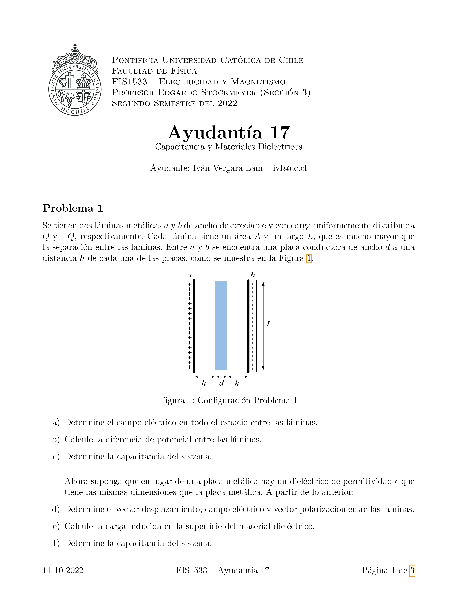
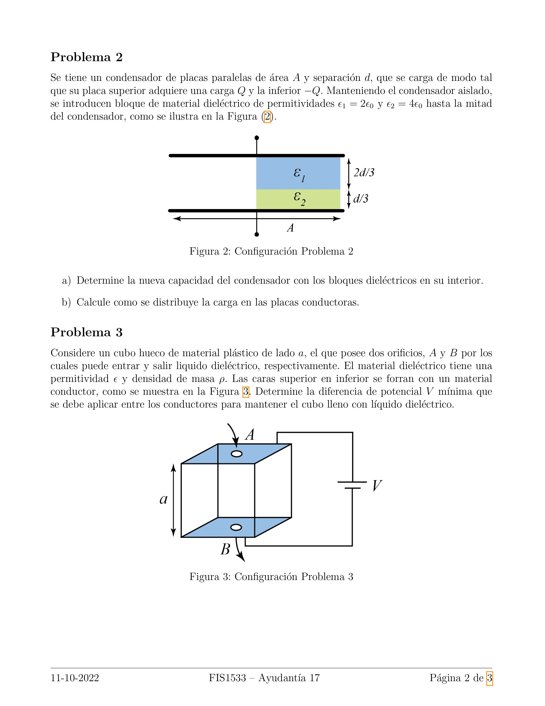
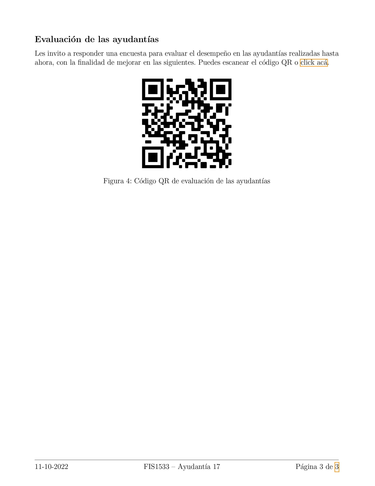

# Template de Latex para ayudantías

Este repositorio contiene un template de Latex utilizado para el desarrollo de ayudantías de Electricidad y Magnetismo durante el semestre 2022-2. Sin embargo, su uso puede extrapolarse a cualquier curso.

Para definir las variables como el nombre del ayudante, la fecha de la ayudantía y el nombre del curso, se debe editar el archivo `config/variables.tex` y reemplazar los valores por defecto.

El archivo `config/usepackages.tex` contiene los paquetes necesarios para el correcto funcionamiento del template. Mientras tanto, la portada se define en el archivo `config/portada.tex`.

El archivo `main.tex` contiene el código principal, en él se divide el documento en secciones y se importa el contenido de cada uno de los problemas ubicados en la carpeta `problemas/`.

Por último, se importa el archivo `evaluacion.tex` que contiene el código QR para la evaluación de la ayudantía, este apartado es completamente opcional.

La estructura del documento es la siguiente:

    .
    ├── config
    │   ├── portada.tex
    │   ├── usepackages.tex
    │   └── variables.tex
    ├── figuras
    │   ├── fig_1.png
    │   ├── fig_2.png
    │   ├── fig_3.png
    │   ├── logo uc.tex
    │   └── qr.png
    ├── problemas
    │    ├── 01_problema.tex
    │    ├── 02_problema.tex
    │    └── 03_problema.tex
    ├── main.tex
    └── evaluacion.tex

Finalmente, el resultado de la compilación del documento es el siguiente:

  
  
  

Hecho con :heart: por [Iván Vergara Lam](https://github.com/ivanvlam)